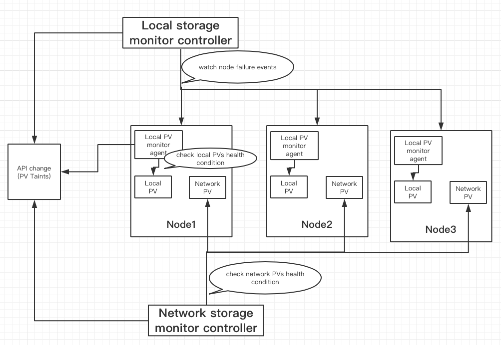

# PV Health Monitor

## Table of Contents

  * [Title](#title)
      * [Table of Contents](#table-of-contents)
      * [Motivation](#motivation)
      * [User Experience](#user-experience)
         * [Use Cases](#use-cases)
      * [Proposal](#proposal)
      * [Implementation](#implementation)
         * [API change](#api-change)
         * [CSI change](#csi-change)
         * [External controller](#external-controller)
         * [External agent](#external-agent)
         * [Simple reactions](#simple-reactions)
      * [Implementation History](#implementation-history)


## Motivation

For now, kubernetes has no way to monitor PVs, which may cause serious problems. 

For example: if volumes are unhealthy, and pods still try to write data to them, which will lead to data loss. 

And also if nodes break down, local PVs in the nodes therefore can not be accessed any more. 

So it is necessary to have a mechanism to monitor PVs.

## User Experience

### User Cases

- If one PV’s volume provisioned by storage driver is deleted, we need to mark the PV to inform users;

- If attaching error occurs, we need to mark the PV too;

- If mounting error occurs, we also need to mark the PV;

- If volume errors are detected by other components deployed by users, we need to mark the PV.


## Proposal

In this proposal, we only focus on PV monitoring, reactions are not in the scope. 

The main architecture is as below:



First of all, i want to note that we divide the PVs health condition checking into three cases

- The health condition checking of PVs themselves, such as if the PV is deleted, if the usage is reaching the threshold...;
- Attaching conditions checking;
- Mounting conditions checking.

And in addition, we plan to create a service to receive PV health condition reports from other compoments deployed by users.

Three main parts are involved here in the architecture.

- API change: we plan to introduce a new Taint called PVUnhealthTaint whose key is specific (PVUnhealthMessage) and value can be set differently.
- External Controller:  responsible for three tasks.
  - Trigger controller RPC to check the health condition of network PVs themselves for network storage;
  - Watch for node failure events for both network and local storage;
  - Create HTTP(RPC) service to receive PVs health condition reports; 
- External Agent: responsible for two tasks.
  - Trigger node RPC  to check PVs’ attaching and mounting conditions for network storage;
     - Since we want to check attaching per node in order to support multi-attach, put attaching check in node RPC here.
  - Trigger controller and node RPC(when ready) to check local PVs health condition for local storage;
    - For now, we do not have CSI support for local storage, we may check the local PVs directly by the agent at first, and then move the checks to RPC interfaces when ready.


## Implementation

### API change

We plan to introduce a new Taint called PVUnhealthMessage for PV health condition whose key is specific (PVUnhealthMessage) and value can be set differently. 

For example, if the PV is not attached now, we can mark the PV using the PVUnhealthMessage taint like this:
```
Key: “PVUnhealthMessage”
Value: “AttachError,the pv is not attached to node1 now”
VolumeTaintEffect: NoEffect
```

If the volume is deleted, we can mark the PV using the PVUnhealthMessage taint like this:
```
Key: “PVUnhealthMessage” 
Value: “VolumeError, the volume is deleted from backend”
VolumeTaintEffect: NoEffect
```

Note that:

- all the VolumeTaintEffects are NoEffect now at first, we may talk about the reactions later in another proposal;
- the taint Value is string now, it is theoretically possible that several errors are detected for one PV, we may extend the string to cover this situation: combine the errors together and splited by semicolon or other symbols.


### CSI change

Container Storage Interface (CSI) specification will be modified to add two RPCs ControllerCheckVolume and NodeCheckVolume. 

- ControllerCheckVolume RPC
  - External controller calls ControllerCheckVolume() to check the health condition of PVs themselves, for example, if the PVs are deleted ...
  - If volume is attached to this node, the external controller calls ControllerCheckVolume() to see if volume is still attached.
- NodeCheckVolume RPC
  - For any PV that is mounted, the external agent calls NodeCheckVolume() to see if volume is still mounted;
  - Calls NodeCheckVolume to check if volume is usable, e.g., filesystem corruption, bad blocks, etc ?

CSI driver needs to implement the following CSI Controller RPC if CHECK_VOLUME controller capability is supported:

- ControllerCheckVolume()

CSI driver also needs to implement the following CSI Node RPC if CHECK_VOLUME node capability is supported:

- NodeCheckVolume()

The RPC changes needed in the CSI Spec are described in the following.

##### Add ControllerCheckVolume RPC
ControllerCheckVolume RPC checks the health condition of PVs themselves, for example if the volume still exists, if the usage is reaching the threshold and so on. ControllerCheckVolume RPC also checks whether the volume is still attached to the node.

```
rpc ControllerCheckVolume (ControllerCheckVolumeRequest)
    returns (ControllerCheckVolumeResponse) {}
```
```
message ControllerCheckVolumeRequest {
  // The ID of the volume to be used on a node.
  // This field is REQUIRED.
  string volume_id = 1;

  // The ID of the node. This field is REQUIRED. The CO SHALL set this
  // field to match the node ID returned by `NodeGetInfo`.
  string node_id = 2;

  // Volume capability describing how the CO intends to use this volume.
  // SP MUST ensure the CO can use the published volume as described.
  // Otherwise SP MUST return the appropriate gRPC error code.
  // This is a OPTIONAL field. (REQUIRED if checking whether attached or not)
  VolumeCapability volume_capability = 3;

  // Indicates SP MUST publish the volume in readonly mode.
  // CO MUST set this field to false if SP does not have the
  // PUBLISH_READONLY controller capability.
  // This is a OPTIONAL field. (REQUIRED if checking whether attached or not)
  bool readonly = 4;

  // Secrets required by plugin to complete controller publish volume
  // request. This field is OPTIONAL. Refer to the
  // `Secrets Requirements` section on how to use this field.
  map<string, string> secrets = 5 [(csi_secret) = true];

  // Volume context as returned by CO in CreateVolumeRequest. This field
  // is OPTIONAL and MUST match the volume_context of the volume
  // identified by `volume_id`.
  map<string, string> volume_context = 6;
}
```
```
message ControllerCheckVolumeResponse {
  // Indicate whether the volume exists
  bool exists = 1;

  // Indicate whether the volume is attached
  bool is_attached = 2;

  // Indicate how much free space is available on the volume
  int64 available_capacity = 3;

  // describe the volume health condition
  string health_condition = 4;
}
```

##### Add NodeCheckVolume RPC
NodeCheckVolume RPC checks if volume is still attached, mounted and usable. 
To check whether a volume is usable, the CSI driver is supposed to check if filesystem is corrupted, whether there are bad blocks, etc. in this RPC.
```
rpc NodeCheckVolume (NodeCheckVolumeRequest)
    returns (NodeCheckVolumeResponse) {}
```
```
message NodeCheckVolumeRequest {
  // The ID of the volume to check. This field is REQUIRED.
  string volume_id = 1;

  // The ID of the node. This field is REQUIRED. The CO SHALL set this
  // field to match the node ID returned by `NodeGetInfo`.
  string node_id = 2;

  // The CO SHALL set this field to the value returned by
  // `ControllerPublishVolume` if the corresponding Controller Plugin
  // has `PUBLISH_UNPUBLISH_VOLUME` controller capability, and SHALL be
  // left unset if the corresponding Controller Plugin does not have
  // this capability. This is an OPTIONAL field.
  map<string, string> publish_context = 3;

  // The path to which the volume was staged by `NodeStageVolume`.
  // It MUST be an absolute path in the root filesystem of the process
  // serving this request.
  // It MUST be set if the Node Plugin implements the
  // `STAGE_UNSTAGE_VOLUME` node capability.
  // This is an OPTIONAL field.
  string staging_target_path = 4;

  // The path to which the volume will be published. It MUST be an
  // absolute path in the root filesystem of the process serving this
  // request. The CO SHALL ensure uniqueness of target_path per volume.
  // The CO SHALL ensure that the parent directory of this path exists
  // and that the process serving the request has `read` and `write`
  // permissions to that parent directory.
  // For volumes with an access type of block, the SP SHALL place the
  // block device at target_path.
  // For volumes with an access type of mount, the SP SHALL place the
  // mounted directory at target_path.
  // Creation of target_path is the responsibility of the SP.
  // This is a REQUIRED field.
  string target_path = 5;

  // Volume capability describing how the CO intends to use this volume.
  // SP MUST ensure the CO can use the published volume as described.
  // Otherwise SP MUST return the appropriate gRPC error code.
  // This is a REQUIRED field.
  VolumeCapability volume_capability = 6;

  // Indicates SP MUST publish the volume in readonly mode.
  // This field is REQUIRED.
  bool readonly = 7;

  // Secrets required by plugin to complete node publish volume request.
  // This field is OPTIONAL. Refer to the `Secrets Requirements`
  // section on how to use this field.
  map<string, string> secrets = 8 [(csi_secret) = true];

  // Volume context as returned by CO in CreateVolumeRequest. This field
  // is OPTIONAL and MUST match the volume_context of the volume
  // identified by `volume_id`.
  map<string, string> volume_context = 9;
}
```
```
message NodeCheckVolumeResponse {
  // Indicate whether the volume is attached to this node
  bool is_attached = 1;

   // Indicate whether the volume is mounted
  bool is_mounted = 2;

  // describe the volume health condition
  string health_condition = 3
}
```

### External controller

#### CSI interface
Call ControllerCheckVolume() RPC for network storage PVs periodically to check the health condition of PVs themselves

#### Node failure event
Watch node failure event for both network and local storage. 
If node breaks down, the attaching and mounting conditions could not be detected by external agent any more, we need to mark the PV here.

#### HTTP(RPC) service
Create a HTTP(RPC) service to receive PVs health condition reports from other components. 
Users can extend the PV health condition monitoring by setting up their own detector and report the result to the service.

### External agent

#### CSI interface
Call NodeCheckVolume() RPC for network storage to check the attaching and mounting conditions.
Call both ControllerCheckVolume() and NodeCheckVolume() RPCs for local storage when local storage CSI support is enabled
For now, check local PVs directly by the agent.


### Simple reactions:

For unbound PVCs/PVs,  we need to prevent binding tainted PVs to PVCs.


## Implementation History

- 20190730: KEP updated

- 20190530: KEP submitted

- Demo implementation (using annotations): 
https://github.com/NickrenREN/kubemonitor/tree/master/build/kube_storage_monitor/local_monitor
https://github.com/NickrenREN/kubemonitor/tree/master/build/kube_storage_monitor/node_watcher
